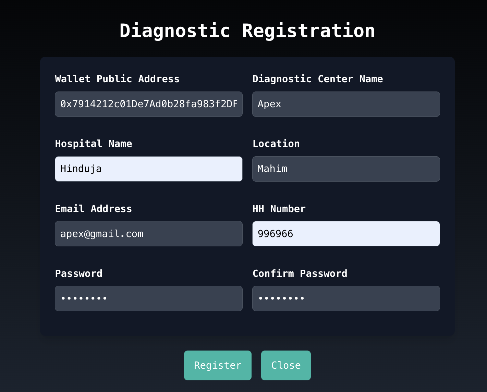
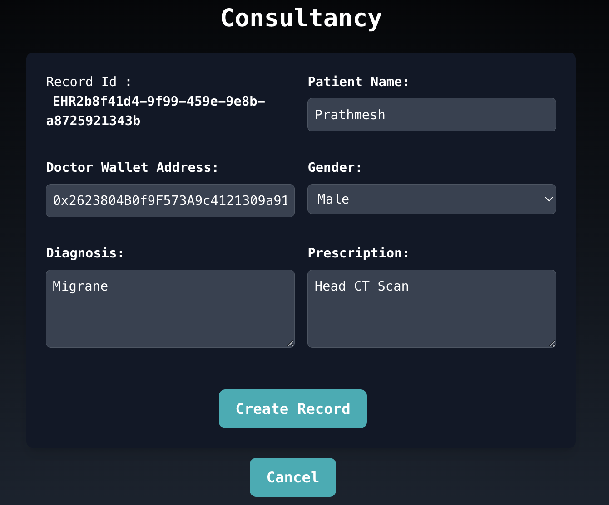

Summary : The "Secure Electronic Health Records" project utilizes Ethereum blockchain, Metamask, and Ganache to enable patients to securely upload medical data and also view his data, manage doctor access, and view data history. Doctors can manage patient lists, access records, generate consultancy reports, and revoke access given by patient. Diagnostic centers can create EHR reports, ensuring visibility for both patients and doctors through IPFS integration. This decentralized approach enhances data security, interoperability, and patient control over health information, ultimately improving healthcare delivery and patient outcomes.

Technology Used :

Blockchain Technology: Ethereum<br>
Blockchain Development Tools: Metamask, Ganache<br>
Decentralized File Storage: IPFS (InterPlanetary File System)<br>
Smart Contract Development: Solidity<br>
Frontend Development: ReactJS<br>
Testing Frameworks: Truffle (for testing Solidity contracts)<br>
Version Control: Git<br>
Development Environment: Node.js<br>


Screenshots : 

HomePage :





Login :


<br>
<br><br>
Patient Side : 
<br>
<br><br>


<br>
<br><br>
Doctor Side :
<br>
<br><br>

<br><br>

<br><br>

<br><br>

<br><br>
<br><br>
Diagnostic Side :
<br>


<br>


<br><br>
Report has been reflected in record viewer so that both patient and doctor can see : 
<br>
<br>


<br><br>


## For Full working project 


🆁🅴🆀🆄🅸🆁🅴🅼🅴🅽🆃🆂

1.Install nodeJs

* [Node JS](https://nodejs.org/en/download/)

2.Install Ganache

* [Ganache Truffle](https://www.trufflesuite.com/ganache)


3.Download IPFS (kubo)

* [IPFS Kubo](https://dist.ipfs.tech/#go-ipfs)

4.Add Metamask Extension in Browser

* [Metamask Chrome](https://chrome.google.com/webstore/detail/metamask/nkbihfbeogaeaoehlefnkodbefgpgknn?hl=en-US)

5.Open cmd in project directory

```
npm install --force
```

6.open cmd/terminal as Administrator and type

```
npm install -g truffle
```

7.Open Ganache
 
 *  New Workspace
 *  AddProject
 *  Select truffle-config.js in Project Directory
 *  Save Workspace

8.Compile and migrate Contracts
 ```
 cd src
 truffle compile
 truffle migrate
 ```
9.Run Server

```
npm start
```
